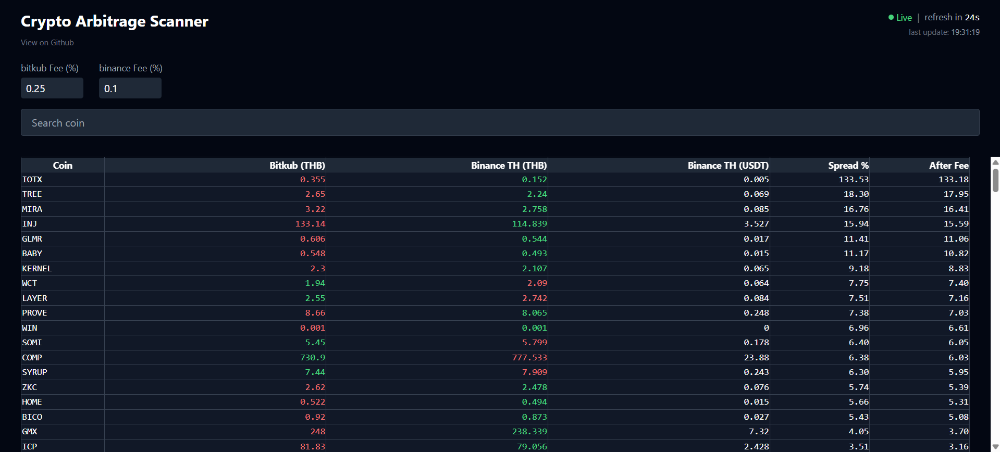

# Crypto Arbitrage Scanner

เครื่องมือเปรียบเทียบราคาคริปโตระหว่าง **Bitkub** (คู่ THB) และ **Binance TH** (คู่ USDT แปลงเป็น THB) แสดงส่วนต่างราคา (spread) ระหว่างสองเว็บให้เห็นในที่เดียว

**[🔴 Live Demo](https://crypto-arbitrage-scanner-three.vercel.app)**

## Screenshots



---
> ⚠️ **คำเตือน:** เครื่องมือนี้จัดทำขึ้นเพื่อการศึกษาเท่านั้น **ไม่ใช่คำแนะนำในการลงทุน** การเทรดคริปโตมีความเสี่ยงสูง ควรศึกษาข้อมูลและตัดสินใจด้วยตัวเองก่อนทำธุรกรรมทางการเงินทุกครั้ง
---

## Features

- แสดงราคา จาก Bitkub และ Binance TH อัปเดตอัตโนมัติทุก 30 วินาที
- คำนวณ spread % ทั้งสองทิศทาง แสดงค่าที่สูงกว่า
- ปรับค่าธรรมเนียมการเทรดได้เพื่อดู spread จริงหลังหักค่าธรรมเนียม
- ค้นหาและกรองตามชื่อเหรียญ

## Tech Stack

**Frontend:** React, Vite, Tailwind CSS, deploy บน Vercel

**Backend:** FastAPI (Python), deploy บน Render

## วิธี Run บนเครื่อง

### Backend

```bash
cd backend
pip install -r requirements.txt
```

สร้างไฟล์ `.env`:
```
ALLOWED_ORIGINS=http://localhost:5173
```

รัน server:
```bash
uvicorn main:app --reload
```

### Frontend

```bash
cd frontend
npm install
```

สร้างไฟล์ `.env.local`:
```
VITE_API_URL=http://localhost:8000
```

รัน dev server:
```bash
npm run dev
```

## Challenges

### 1. การ map ราคาข้าม exchange ที่มี pair coverage ต่างกัน

แผนแรกคือดึงคู่ THB จากทั้ง Bitkub และ Binance TH เพื่อเทียบราคาตรงไปตรงมา แต่พอเช็กพบว่า Binance TH มีคู่ THB น้อยมาก ครอบคลุมเหรียญไม่พอจะหา arbitrage opportunity ได้จริง → เปลี่ยน design เป็นดึงคู่ THB จาก Bitkub และคู่ USDT จาก Binance TH แล้วแปลง USDT→THB โดยอิง rate USDT/THB ของ Bitkub

### 2. Render free tier cold start

Render ปิด container อัตโนมัติเมื่อไม่มี traffic — ครั้งถัดไปที่ user เปิดเว็บ backend ต้องใช้เวลา 30–60 วินาที warm up ทำให้ frontend ค้างหน้าจอเปล่าเหมือนเว็บพัง → เพิ่ม loading screen ที่ frontend แจ้ง state ชัดเจนว่า "เซิร์ฟเวอร์กำลังตื่น" พร้อม progress bar และ elapsed time
